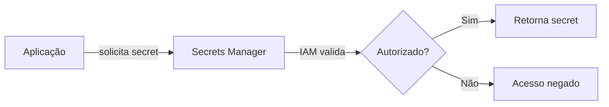
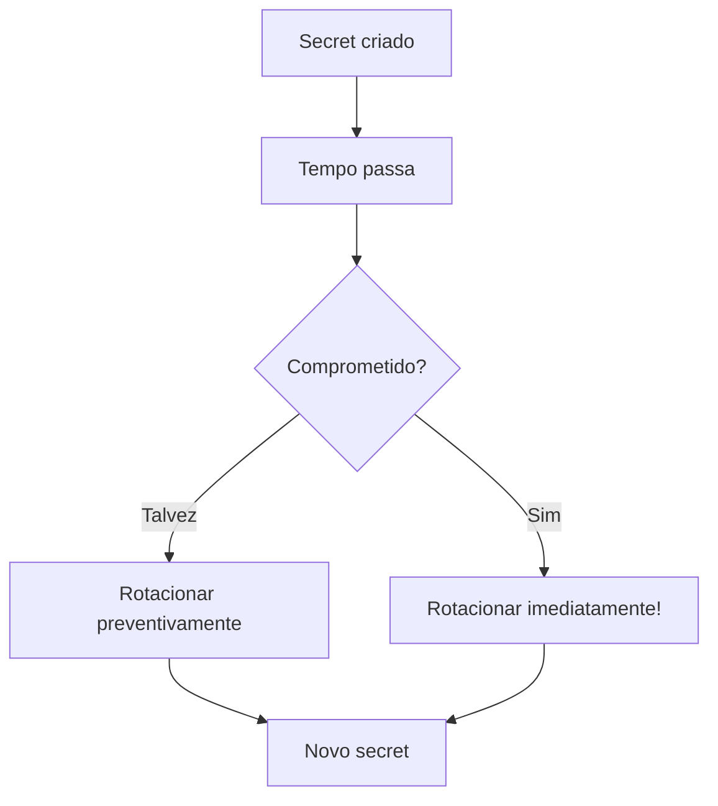
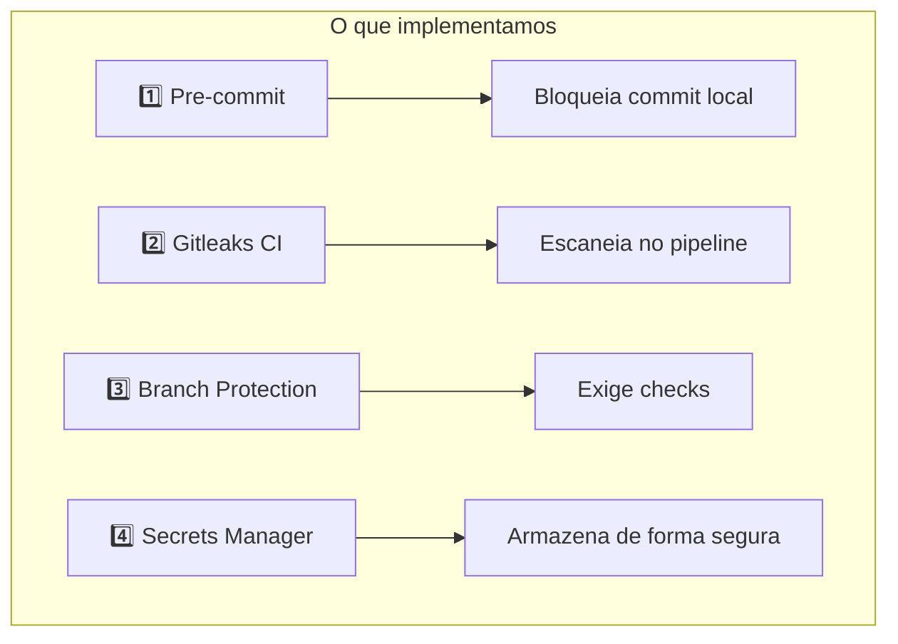

# Vídeo 2.3 - AWS Secrets Manager

**Aula**: 2 - Gestão de Segredos
**Vídeo**: 2.3
**Temas**: AWS Secrets Manager; Armazenamento seguro; Integração com aplicação; Rotação de secrets

---

## Antes de Começar

> **Continuação do Vídeo 2.2** - Agora vamos gerenciar secrets de forma segura.

### Pré-requisitos

| Requisito | Como verificar |
|-----------|----------------|
| AWS CLI configurado | `aws sts get-caller-identity --profile fiapaws` |
| Sessão Learner Lab ativa | no console |
| App deployada (opcional) | Para testar integração |

---

## Parte 1: Onde Guardar Secrets?

### Passo 1: Opções de Armazenamento

| Opção | Segurança | Problema |
|-------|-----------|----------|
| ❌ Hardcoded no código | Péssima | Vaza no Git |
| ❌ Arquivo .env | Ruim | Pode ser commitado |
| ⚠️ Variáveis de ambiente | Média | Difícil rotacionar |
| ⚠️ GitHub Secrets | Boa | Só para CI/CD |
| ✅ **Secrets Manager** | Excelente | Ideal para produção |

---

### Passo 2: O que é AWS Secrets Manager?

**AWS Secrets Manager** = Serviço gerenciado para armazenar secrets



**Benefícios:**
- ✅ Encriptação automática (KMS)
- ✅ Rotação automática de senhas
- ✅ Auditoria via CloudTrail
- ✅ Controle de acesso via IAM
- ✅ Versionamento de secrets

---

### Passo 3: Conceitos Importantes

| Termo | Significado |
|-------|-------------|
| **Secret** | Um valor armazenado (pode ser JSON) |
| **Secret Name** | Identificador único (ex: `devsecops/app/db`) |
| **Secret Value** | O conteúdo (string ou JSON) |
| **Version** | Histórico de alterações |
| **Rotation** | Atualização automática periódica |

---

## ☁️ Parte 2: Criar Secret na AWS

### Passo 4: Criar Secret via Console

1. No console AWS, busque **Secrets Manager**
2. Clique em **Store a new secret**
3. Configure:

| Campo | Valor |
|-------|-------|
| Secret type | **Other type of secret** |
| Key/value pairs | Ver abaixo |

**Adicionar os pares:**
```
db_host     = database.example.com
db_user     = admin
db_password = SuperSecretPass123!
```

4. Clique **Next**
5. Secret name: `devsecops/app/credentials`
6. Clique **Next** > **Next** > **Store**

---

### Passo 5: Criar Secret via CLI

**Linux/Mac:**
```bash
# Criar secret
aws secretsmanager create-secret \
  --name devsecops/app/credentials \
  --description "Credenciais da aplicação DevSecOps" \
  --secret-string '{"db_host":"database.example.com","db_user":"admin","db_password":"SuperSecretPass123!"}' \
  --profile fiapaws \
  --region us-east-1
```

**Windows (PowerShell):**
```powershell
# Criar secret
aws secretsmanager create-secret `
  --name devsecops/app/credentials `
  --description "Credenciais da aplicação DevSecOps" `
  --secret-string '{"db_host":"database.example.com","db_user":"admin","db_password":"SuperSecretPass123!"}' `
  --profile fiapaws `
  --region us-east-1
```

**Resultado esperado:**
```json
{
    "ARN": "arn:aws:secretsmanager:us-east-1:123456789012:secret:devsecops/app/credentials-AbCdEf",
    "Name": "devsecops/app/credentials",
    "VersionId": "xxx-xxx-xxx"
}
```

---

### Passo 6: Verificar Secret

**Linux/Mac:**
```bash
# Listar secrets
aws secretsmanager list-secrets \
  --profile fiapaws \
  --region us-east-1

# Obter valor do secret
aws secretsmanager get-secret-value \
  --secret-id devsecops/app/credentials \
  --profile fiapaws \
  --region us-east-1
```

**Resultado esperado:**
```json
{
    "SecretString": "{\"db_host\":\"database.example.com\",\"db_user\":\"admin\",\"db_password\":\"SuperSecretPass123!\"}"
}
```

---

## 🐍 Parte 3: Integrar com Aplicação Python

### Passo 7: Atualizar o `app.py`

Substitua o conteúdo do arquivo `app.py` pelo código abaixo.

> 💡 **O que mudou?** Adicionamos a função `get_secret()` e a integração com AWS Secrets Manager. O código antigo está comentado para referência.

**Novo `app.py` completo:**

```python
"""
DevSecOps Lab - Aplicação Vulnerável para Fins Educacionais
ATENÇÃO: Esta aplicação contém vulnerabilidades INTENCIONAIS para demonstração.
NÃO USE EM PRODUÇÃO!
"""

import json
import os
import sqlite3
import subprocess

import boto3
from botocore.exceptions import ClientError
from flask import Flask, jsonify, render_template_string, request

app = Flask(__name__)

# Configuração do banco de dados
DATABASE = os.getenv("DATABASE_PATH", "users.db")


# ============================================
# AWS SECRETS MANAGER - NOVO!
# ============================================


def get_secret(secret_name: str, region: str = "us-east-1") -> dict:
    """
    Busca um secret do AWS Secrets Manager.

    Args:
        secret_name: Nome do secret (ex: devsecops/app/credentials)
        region: Região AWS

    Returns:
        dict: Conteúdo do secret parseado como JSON
    """
    client = boto3.client("secretsmanager", region_name=region)

    try:
        response = client.get_secret_value(SecretId=secret_name)
        secret_string = response["SecretString"]
        return json.loads(secret_string)
    except ClientError as e:
        print(f"Erro ao buscar secret: {e}")
        raise


# ============================================
# CONFIGURAÇÃO DE CREDENCIAIS
# ============================================
# ANTES (inseguro - hardcoded ou variáveis de ambiente):
# DB_HOST = os.getenv("DB_HOST", "localhost")
# DB_USER = os.getenv("DB_USER", "admin")
# DB_PASSWORD = os.getenv("DB_PASSWORD", "senha123")

# DEPOIS (seguro - AWS Secrets Manager):
try:
    secrets = get_secret("devsecops/app/credentials")
    DB_HOST = secrets["db_host"]
    DB_USER = secrets["db_user"]
    DB_PASSWORD = secrets["db_password"]
    print("✅ Secrets carregados do AWS Secrets Manager")
except Exception as e:
    print(f"⚠️ Não foi possível carregar secrets da AWS: {e}")
    # Fallback para desenvolvimento local
    DB_HOST = "localhost"
    DB_USER = "dev"
    DB_PASSWORD = "dev123"


def get_db():
    """Conecta ao banco de dados SQLite"""
    conn = sqlite3.connect(DATABASE)
    conn.row_factory = sqlite3.Row
    return conn


def init_db():
    """Inicializa o banco de dados com dados de exemplo"""
    conn = get_db()
    conn.execute(
        """
        CREATE TABLE IF NOT EXISTS users (
            id INTEGER PRIMARY KEY AUTOINCREMENT,
            username TEXT NOT NULL,
            email TEXT NOT NULL,
            password TEXT NOT NULL
        )
    """
    )
    # Dados de exemplo
    conn.execute(
        "INSERT OR IGNORE INTO users (id, username, email, password) "
        "VALUES (1, 'admin', 'admin@example.com', 'admin123')"
    )
    conn.execute(
        "INSERT OR IGNORE INTO users (id, username, email, password) "
        "VALUES (2, 'user', 'user@example.com', 'user123')"
    )
    conn.commit()
    conn.close()


# ============================================
# ENDPOINTS DA APLICAÇÃO
# ============================================


@app.route("/")
def home():
    """Página inicial"""
    return jsonify(
        {
            "app": "DevSecOps Lab",
            "version": "1.0.0",
            "status": "running",
            "endpoints": [
                "GET /health",
                "GET /db-status",
                "GET /users",
                "GET /user?id=1",
                "GET /search?q=termo",
                "POST /login",
            ],
        }
    )


@app.route("/health")
def health():
    """Health check para o container"""
    return jsonify({"status": "healthy"})


@app.route("/db-status")
def db_status():
    """Endpoint para verificar configuração do banco (sem expor senha!)"""
    return jsonify(
        {
            "status": "configured",
            "host": DB_HOST,
            "user": DB_USER,
            "password": "********",  # NUNCA exponha a senha!
        }
    )


@app.route("/users")
def list_users():
    """Lista todos os usuários"""
    conn = get_db()
    users = conn.execute("SELECT id, username, email FROM users").fetchall()
    conn.close()
    return jsonify([dict(user) for user in users])


# ============================================
# VULNERABILIDADES INTENCIONAIS (PARA DEMO)
# ============================================


@app.route("/user")
def get_user():
    """
    VULNERABILIDADE: SQL Injection
    Exemplo de exploração: /user?id=1 OR 1=1
    """
    user_id = request.args.get("id", "1")
    conn = get_db()
    # INSEGURO: Concatenação direta de input do usuário
    query = f"SELECT * FROM users WHERE id = {user_id}"
    try:
        user = conn.execute(query).fetchone()
        conn.close()
        if user:
            return jsonify(dict(user))
        return jsonify({"error": "User not found"}), 404
    except Exception as e:
        return jsonify({"error": str(e)}), 500


@app.route("/search")
def search():
    """
    VULNERABILIDADE: Cross-Site Scripting (XSS)
    Exemplo de exploração: /search?q=<script>alert('XSS')</script>
    """
    query = request.args.get("q", "")
    # INSEGURO: Renderiza input do usuário sem sanitização
    html = f"""
    <html>
        <head><title>Search Results</title></head>
        <body>
            <h1>Resultados para: {query}</h1>
            <p>Nenhum resultado encontrado.</p>
        </body>
    </html>
    """
    return render_template_string(html)


@app.route("/ping")
def ping():
    """
    VULNERABILIDADE: Command Injection
    Exemplo de exploração: /ping?host=localhost;cat /etc/passwd
    """
    host = request.args.get("host", "localhost")
    # INSEGURO: Input do usuário passado direto para shell
    try:
        result = subprocess.check_output(
            f"ping -c 1 {host}", shell=True, text=True
        )
        return f"<pre>{result}</pre>"
    except subprocess.CalledProcessError as e:
        return f"<pre>Error: {e}</pre>", 500


@app.route("/login", methods=["POST"])
def login():
    """
    VULNERABILIDADE: Credenciais em log
    """
    data = request.get_json() or {}
    username = data.get("username", "")
    password = data.get("password", "")

    # INSEGURO: Loga credenciais (expostas em logs do container)
    print(f"Login attempt: username={username}, password={password}")

    conn = get_db()
    # INSEGURO: SQL Injection no login
    query = (
        f"SELECT * FROM users "
        f"WHERE username = '{username}' AND password = '{password}'"
    )
    user = conn.execute(query).fetchone()
    conn.close()

    if user:
        return jsonify({"message": "Login successful", "user": dict(user)})
    return jsonify({"error": "Invalid credentials"}), 401


# ============================================
# INICIALIZAÇÃO
# ============================================

if __name__ == "__main__":
    init_db()
    # INSEGURO: Debug mode em produção
    app.run(host="0.0.0.0", port=5000, debug=True)
```

---

### Passo 8: Entender as Mudanças

| Antes (Inseguro) | Depois (Seguro) |
|------------------|-----------------|
| `DB_PASSWORD = os.getenv("DB_PASSWORD")` | `secrets = get_secret("devsecops/app/credentials")` |
| Senha em variável de ambiente | Senha buscada em runtime da AWS |
| Pode vazar em logs/dumps | Nunca fica no código ou ambiente |

---

### Passo 9: Testar Localmente

**Linux/Mac:**
```bash
cd ~/projetos/fiap-dclt-devsecops-aula02

# Criar e ativar ambiente virtual (primeira vez)
python3 -m venv venv
source venv/bin/activate

# Instalar dependências (primeira vez)
pip install -r requirements.txt

# Configurar profile AWS
export AWS_PROFILE=fiapaws

# Rodar aplicação
python app.py
```

> 💡 **Nas próximas vezes**, só precisa ativar o venv: `source venv/bin/activate`

**Testar endpoint:**
```bash
curl http://localhost:5001/db-status
```

**Resultado esperado:**
```json
{
    "status": "configured",
    "host": "database.example.com",
    "user": "admin",
    "password": "********"
}
```

---

## 🔄 Parte 4: Rotação de Secrets

### Passo 10: Por que Rotacionar?



**Boas práticas:**
- Rotacionar senhas a cada 30-90 dias
- Rotacionar imediatamente se houver suspeita de vazamento
- Usar rotação automática quando possível

---

### Passo 11: Atualizar Secret Manualmente

**Linux/Mac:**
```bash
# Atualizar valor do secret
aws secretsmanager update-secret \
  --secret-id devsecops/app/credentials \
  --secret-string '{"db_host":"database.example.com","db_user":"admin","db_password":"NovaSenha456!"}' \
  --profile fiapaws \
  --region us-east-1
```

**Windows (PowerShell):**
```powershell
aws secretsmanager update-secret `
  --secret-id devsecops/app/credentials `
  --secret-string '{"db_host":"database.example.com","db_user":"admin","db_password":"NovaSenha456!"}' `
  --profile fiapaws `
  --region us-east-1
```

> 💡 **Nota**: A aplicação vai pegar o novo valor automaticamente na próxima vez que buscar o secret.

---

## 🔒 Parte 5: Resumo das 4 Camadas

### Passo 12: Recapitulação



| Camada | Ferramenta | Quando atua |
|--------|------------|-------------|
| 1 | Pre-commit + Gitleaks | Antes do commit |
| 2 | Gitleaks Action | No push/PR |
| 3 | Branch Protection | No merge para main |
| 4 | Secrets Manager | Em runtime |

---

## 🔧 Troubleshooting

| Erro | Causa | Solução |
|------|-------|---------|
| `AccessDeniedException` | Sem permissão | Verificar IAM role |
| `ResourceNotFoundException` | Secret não existe | Verificar nome e região |
| `ExpiredTokenException` | Credenciais expiradas | Atualizar AWS credentials |
| Aplicação não encontra secret | Região errada | Verificar `region_name` |

---

## 📖 Leitura Complementar

- [AWS Secrets Manager Docs](https://docs.aws.amazon.com/secretsmanager/)
- [Boto3 Secrets Manager](https://boto3.amazonaws.com/v1/documentation/api/latest/reference/services/secretsmanager.html)

---

**FIM DO VÍDEO 2.3** ✅
