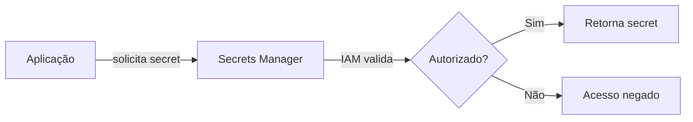
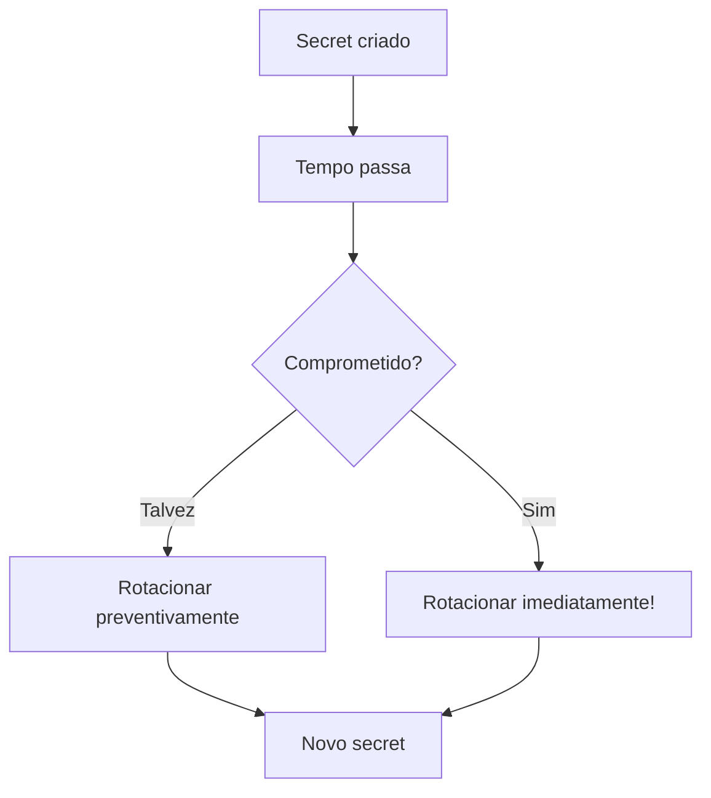
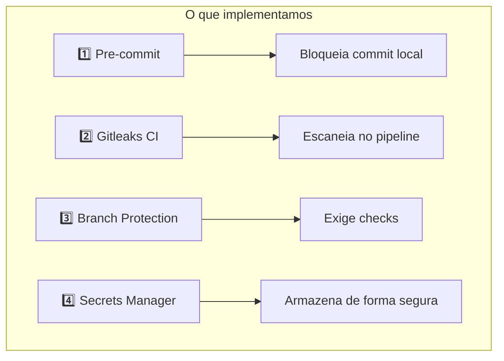

# Vídeo 2.3 - AWS Secrets Manager

**Aula**: 2 - Gestão de Segredos  
**Vídeo**: 2.3  
**Temas**: AWS Secrets Manager; Armazenamento seguro; Integração com aplicação; Rotação de secrets

---

## Antes de Começar

> **Continuação do Vídeo 2.2** - Agora vamos gerenciar secrets de forma segura.

### Pré-requisitos

| Requisito | Como verificar |
|-----------|----------------|
| AWS CLI configurado | `aws sts get-caller-identity --profile fiapaws` |
| Sessão Learner Lab ativa | no console |
| App deployada (opcional) | Para testar integração |

---

## Parte 1: Onde Guardar Secrets?

### Passo 1: Opções de Armazenamento

| Opção | Segurança | Problema |
|-------|-----------|----------|
| ❌ Hardcoded no código | Péssima | Vaza no Git |
| ❌ Arquivo .env | Ruim | Pode ser commitado |
| ⚠️ Variáveis de ambiente | Média | Difícil rotacionar |
| ⚠️ GitHub Secrets | Boa | Só para CI/CD |
| ✅ **Secrets Manager** | Excelente | Ideal para produção |

---

### Passo 2: O que é AWS Secrets Manager?

**AWS Secrets Manager** = Serviço gerenciado para armazenar secrets



**Benefícios:**
- ✅ Encriptação automática (KMS)
- ✅ Rotação automática de senhas
- ✅ Auditoria via CloudTrail
- ✅ Controle de acesso via IAM
- ✅ Versionamento de secrets

---

### Passo 3: Conceitos Importantes

| Termo | Significado |
|-------|-------------|
| **Secret** | Um valor armazenado (pode ser JSON) |
| **Secret Name** | Identificador único (ex: `devsecops/app/db`) |
| **Secret Value** | O conteúdo (string ou JSON) |
| **Version** | Histórico de alterações |
| **Rotation** | Atualização automática periódica |

---

## ☁️ Parte 2: Criar Secret na AWS

### Passo 4: Criar Secret via Console

1. No console AWS, busque **Secrets Manager**
2. Clique em **Store a new secret**
3. Configure:

| Campo | Valor |
|-------|-------|
| Secret type | **Other type of secret** |
| Key/value pairs | Ver abaixo |

**Adicionar os pares:**
```
db_host     = database.example.com
db_user     = admin
db_password = SuperSecretPass123!
```

4. Clique **Next**
5. Secret name: `devsecops/app/credentials`
6. Clique **Next** > **Next** > **Store**

---

### Passo 5: Criar Secret via CLI

**Linux/Mac:**
```bash
# Criar secret
aws secretsmanager create-secret \
  --name devsecops/app/credentials \
  --description "Credenciais da aplicação DevSecOps" \
  --secret-string '{"db_host":"database.example.com","db_user":"admin","db_password":"SuperSecretPass123!"}' \
  --profile fiapaws \
  --region us-east-1
```

**Windows (PowerShell):**
```powershell
# Criar secret
aws secretsmanager create-secret `
  --name devsecops/app/credentials `
  --description "Credenciais da aplicação DevSecOps" `
  --secret-string '{"db_host":"database.example.com","db_user":"admin","db_password":"SuperSecretPass123!"}' `
  --profile fiapaws `
  --region us-east-1
```

**Resultado esperado:**
```json
{
    "ARN": "arn:aws:secretsmanager:us-east-1:123456789012:secret:devsecops/app/credentials-AbCdEf",
    "Name": "devsecops/app/credentials",
    "VersionId": "xxx-xxx-xxx"
}
```

---

### Passo 6: Verificar Secret

**Linux/Mac:**
```bash
# Listar secrets
aws secretsmanager list-secrets \
  --profile fiapaws \
  --region us-east-1

# Obter valor do secret
aws secretsmanager get-secret-value \
  --secret-id devsecops/app/credentials \
  --profile fiapaws \
  --region us-east-1
```

**Resultado esperado:**
```json
{
    "SecretString": "{\"db_host\":\"database.example.com\",\"db_user\":\"admin\",\"db_password\":\"SuperSecretPass123!\"}"
}
```

---

## 🐍 Parte 3: Integrar com Aplicação Python

### Passo 7: Código para Buscar Secret

Adicione esta função ao seu `app.py`:

```python
import boto3
import json
from botocore.exceptions import ClientError

def get_secret(secret_name: str, region: str = "us-east-1") -> dict:
    """
    Busca um secret do AWS Secrets Manager.
    
    Args:
        secret_name: Nome do secret (ex: devsecops/app/credentials)
        region: Região AWS
    
    Returns:
        dict: Conteúdo do secret parseado como JSON
    """
    client = boto3.client('secretsmanager', region_name=region)
    
    try:
        response = client.get_secret_value(SecretId=secret_name)
        secret_string = response['SecretString']
        return json.loads(secret_string)
    except ClientError as e:
        print(f"Erro ao buscar secret: {e}")
        raise
```

---

### Passo 8: Usar Secret na Aplicação

```python
from flask import Flask, jsonify

app = Flask(__name__)

# Carregar secrets na inicialização
try:
    secrets = get_secret("devsecops/app/credentials")
    DB_HOST = secrets['db_host']
    DB_USER = secrets['db_user']
    DB_PASSWORD = secrets['db_password']
except Exception as e:
    print(f"⚠️ Não foi possível carregar secrets: {e}")
    # Fallback para desenvolvimento local
    DB_HOST = "localhost"
    DB_USER = "dev"
    DB_PASSWORD = "dev123"

@app.route('/db-status')
def db_status():
    """Endpoint para verificar conexão (sem expor senha!)"""
    return jsonify({
        "status": "configured",
        "host": DB_HOST,
        "user": DB_USER,
        "password": "********"  # NUNCA exponha a senha!
    })
```

---

### Passo 9: Testar Localmente

**Linux/Mac:**
```bash
cd ~/projetos/aula02-secrets

# Configurar profile AWS
export AWS_PROFILE=fiapaws

# Rodar aplicação
python app.py
```

**Testar endpoint:**
```bash
curl http://localhost:5000/db-status
```

**Resultado esperado:**
```json
{
    "status": "configured",
    "host": "database.example.com",
    "user": "admin",
    "password": "********"
}
```

---

## 🔄 Parte 4: Rotação de Secrets

### Passo 10: Por que Rotacionar?



**Boas práticas:**
- Rotacionar senhas a cada 30-90 dias
- Rotacionar imediatamente se houver suspeita de vazamento
- Usar rotação automática quando possível

---

### Passo 11: Atualizar Secret Manualmente

**Linux/Mac:**
```bash
# Atualizar valor do secret
aws secretsmanager update-secret \
  --secret-id devsecops/app/credentials \
  --secret-string '{"db_host":"database.example.com","db_user":"admin","db_password":"NovaSenha456!"}' \
  --profile fiapaws \
  --region us-east-1
```

**Windows (PowerShell):**
```powershell
aws secretsmanager update-secret `
  --secret-id devsecops/app/credentials `
  --secret-string '{"db_host":"database.example.com","db_user":"admin","db_password":"NovaSenha456!"}' `
  --profile fiapaws `
  --region us-east-1
```

> 💡 **Nota**: A aplicação vai pegar o novo valor automaticamente na próxima vez que buscar o secret.

---

## 🔒 Parte 5: Resumo das 4 Camadas

### Passo 12: Recapitulação



| Camada | Ferramenta | Quando atua |
|--------|------------|-------------|
| 1 | Pre-commit + Gitleaks | Antes do commit |
| 2 | Gitleaks Action | No push/PR |
| 3 | Branch Protection | No merge para main |
| 4 | Secrets Manager | Em runtime |

---

## 🔧 Troubleshooting

| Erro | Causa | Solução |
|------|-------|---------|
| `AccessDeniedException` | Sem permissão | Verificar IAM role |
| `ResourceNotFoundException` | Secret não existe | Verificar nome e região |
| `ExpiredTokenException` | Credenciais expiradas | Atualizar AWS credentials |
| Aplicação não encontra secret | Região errada | Verificar `region_name` |

---

## ✅ Checkpoint

Ao final deste vídeo você deve ter:

- [ ] Entender vantagens do Secrets Manager
- [ ] Secret criado na AWS
- [ ] Código Python para buscar secrets
- [ ] Endpoint `/db-status` funcionando
- [ ] Entender rotação de secrets

---

## 📖 Leitura Complementar

- [AWS Secrets Manager Docs](https://docs.aws.amazon.com/secretsmanager/)
- [Boto3 Secrets Manager](https://boto3.amazonaws.com/v1/documentation/api/latest/reference/services/secretsmanager.html)

---

**FIM DO VÍDEO 2.3** ✅
